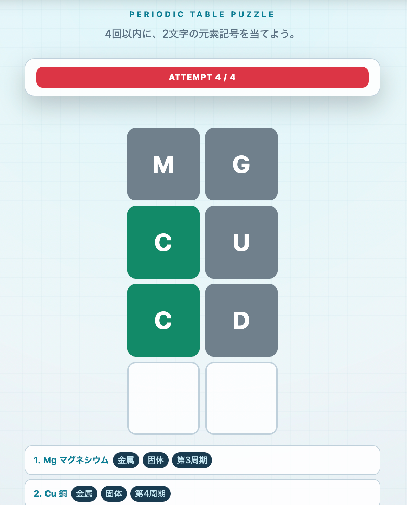

# ELEMENTLE

2文字の元素記号を4回以内に当てる、WORDLE風のブラウザパズルです。

## 遊び方

`index.html` をブラウザで開いてください。画面キーボードとパソコンのキーボードの両方に対応しています。

- 緑：文字と位置が一致
- 黄：文字は含まれるが位置が違う
- 灰：正解に含まれない

## モードと補助機能

- イージー：身近な2文字元素24種類から出題
- ハード：全2文字元素記号104種類から出題（全118元素のうち1文字記号14種類を除く）
- 元素記号に使われない文字はキーボード上で無効化
- 元素一覧から記号と日本語名を見て選択可能
- 分類・常温での状態・周期・身近な用途を段階的に表示するヒント
- 回答後は元素の性質、ゲーム終了後は元素ミニ図鑑を表示
- navbarのFont Awesomeアイコンから難易度・遊び方・Light／Dark／Autoテーマを設定

Bootstrap 5はCDNから読み込むため、初回表示時はインターネット接続が必要です。
